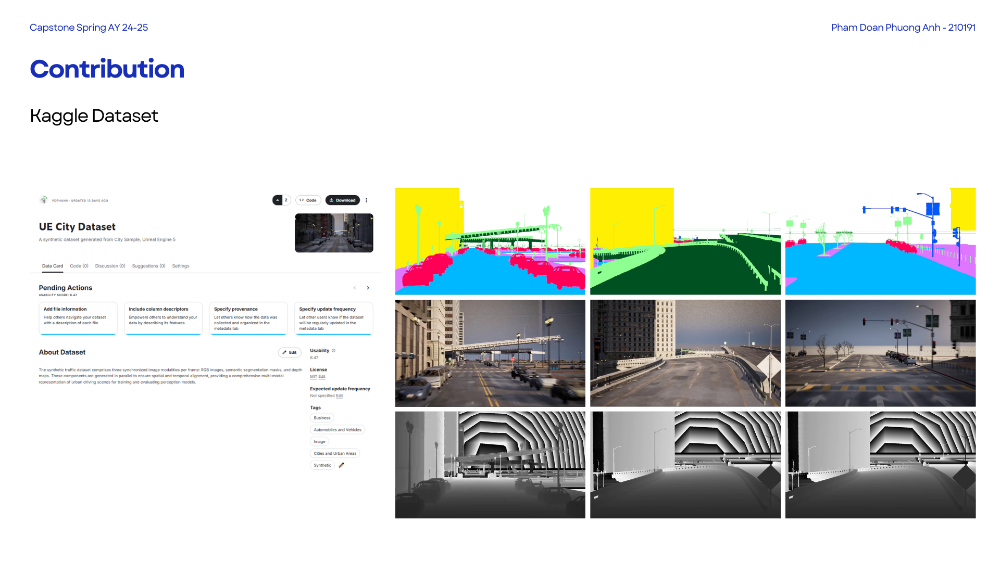
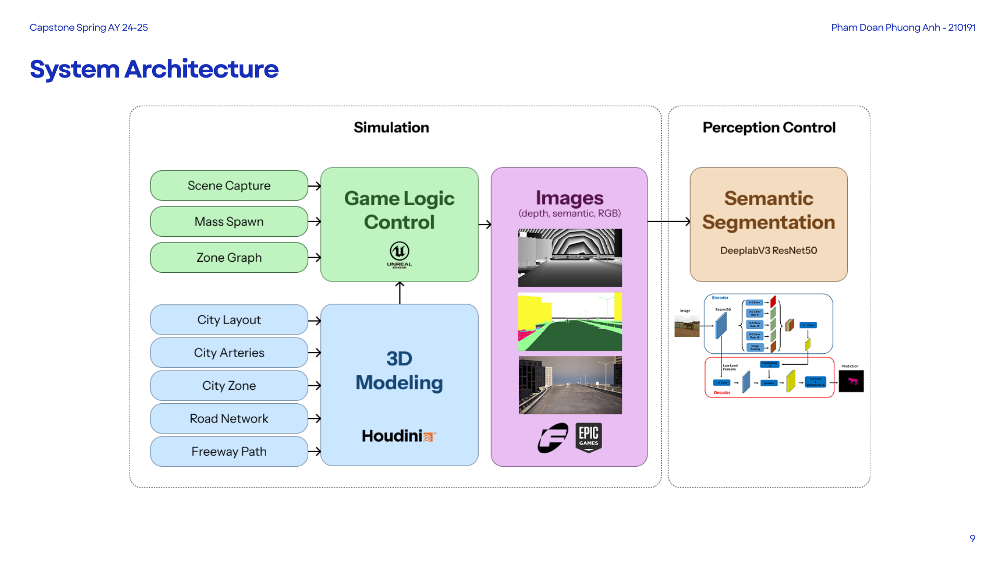
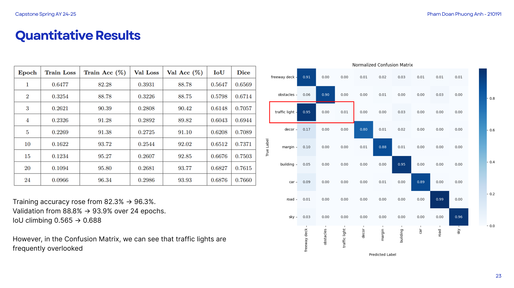

# Capstone Project: "_Designing a Photorealistic Simulation Platform for Robust Semantic Segmentation in Autonomous Vehicles"_

## Overview

This repository presents a comprehensive pipeline designed to address the data scarcity challenges in autonomous driving systems. By leveraging synthetic data generation through a simulation platform, the project aims to create realistic traffic scenarios for training semantic segmentation models. The primary objective is to enhance the accuracy and robustness of traffic light detection in various driving conditions.

**3 type synchronized images
**

## Project Structure

The project is organized into the following key modules:

- **Simulation Platform**: Generates synthetic traffic scenarios using computer vision techniques.
- **Data Preprocessing**: Processes and prepares the synthetic dataset for training.
- **Model Training**: Implements semantic segmentation models to classify traffic-related objects.
- **Evaluation**: Assesses model performance and identifies areas for improvement.

## Result

## Further Research Directions

To address the challenges identified, future work will focus on:

- **Enhancing Data Balance**: Implementing advanced data augmentation and synthetic data generation techniques to balance the dataset.
- **Model Optimization**: Exploring alternative semantic segmentation architectures and loss functions to improve performance on minority classes.
- **Real-World Validation**: Testing the developed models in real-world traffic scenarios to evaluate their applicability and robustness.

## Requirements

- Python 3.x
- Jupyter Notebook
- Required Python libraries (to be listed)

## Acknowledgement
* EasySynth (https://github.com/ydrive/EasySynth/tree/main)  
